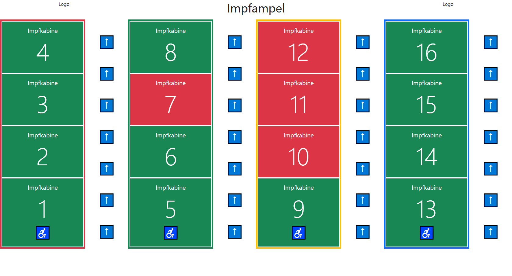
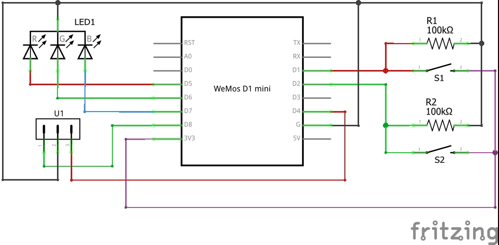

# Impfampel

Das Projekt dient dazu den Personenfluss in einem Impfzentrum besser zu lenken. Dazu wird an einer vorgelagerten Stelle ein Monitor mit einer Übersicht der Belegung der Impfkabinen aufgestellt. Der Monitior kann mit einem Raspberry Pi bespielt werden. Dieser kann zeitgleich den Server bereitstellen. In den Impfkabinen gibt es eine Steuerung auf Basis eines ESP8266 mit zwei Knöpfen. Diese stellen den Status auf frei (grün) bzw. belegt (rot). Eine Status LED ist am Gerät angebracht und zeigt den aktuellen Zustand an. Eine weitere LED kann z.B. vor der Impfkabine angebracht werden.

## Getting started

Vorraussetzungen:

 - Server mit Apache, PHP, Mysql
 - Gerät zur Steuerung z.B. ESP8266
 
1. Ordnerinhalt Server in ein Verzeichnis der Webservers kopieren.
2. Datenbankstruktur anhand der Impfampel.sql Datei erzeugen.
3. Datenbankbenutzer anlegen und im Webserver in der db.php Datei anpassen.
4. ggf. Steuerungsgeräte mit Arduino IDE flashen.
   1. Im Skript [Impfampel.ino](Impfampel.ino) die Variablen `ssid` und `password` mit den entsprechenden Daten des Wlans befüllen.
   2. In der Variable `device` die Zahl der Impfkabine eintragen.
   3. In der Variable `server` die IP-Adresse des Servers eintragen.
   4. Skript auf Microkontroller flashen.

## Steuergerät

Das Steuergerät basiert auf einem D1 Mini Pro mit externer Antenne. Taster S1 schaltet auf belegt(rot). Taster S2 schaltet auf frei(grün). An die Steckverbindung U1 kann eine zusätzliche RGB LED zum anzeigen des Status außerhalb der Impfkabine angeschlossen werden.

### Bauteilliste
Bauteil | Anzahl | Reichelt Artikel-Nr.
--- | --- | ---
D1 Mini Pro | 1 | [D1 MINI-PRO ANT](https://www.reichelt.de/d1-mini-pro-esp8266-cp2104-set-mit-antenne-d1-mini-pro-ant-p266067.html?&trstct=pos_0&nbc=1)
Taster grün | 1 | [T 250A GN](https://www.reichelt.de/miniatur-drucktaster-0-5a-24vac-1x-ein-gn-t-250a-gn-p19985.html?&trstct=pos_0&nbc=1)
Taster rot | 1 | [T 113A RT](https://www.reichelt.de/miniatur-drucktaster-0-5a-24vac-1x-ein-rt-t-113a-rt-p45166.html?&trstct=pos_0&nbc=1)
USB Netzteil | 1 | [OTB 8012053](https://www.reichelt.de/usb-ladegeraet-5-v-2500-ma-schwarz-microusb-otb-8012053-p263200.html?&trstct=pos_0&nbc=1)
Gehäuse | 1 | [GEH KS 42](https://www.reichelt.de/kleingehaeuse-72-x-50-x-42-mm-geh-ks-42-p8162.html?&trstct=pos_0&nbc=1)
RGB LED | 1 | [LED LL 5-8000RGB](https://www.reichelt.de/rgb-led-5-mm-bedrahtet-4-pin-rt-gn-bl-8000-mcd-25--led-ll-5-8000rgb-p156358.html?&trstct=pos_10&nbc=1)
100 kOhm Widerstand | 2 | [K-O SFCN1003T52](https://www.reichelt.de/widerstand-metallschicht-100-kohm-0207-0-6-w-1--k-o-sfcn1003t52-p237347.html?&trstct=pos_0&nbc=1)

## HTTP-Endpunkte

Pfad | Parameter | Beschreibung
--- | --- | ---
`/index.php` |  | Startseite mit Link zum Dashboard oder Mobilvariante.
`/dashboard.php` |  | Das Dashboard zum anzeigen auf einem Bildschirm.
`/mobile.php` |  | Mobile Ansicht des Dashboards.
`/device.php` | `GET status, device` | Endpunkt für die Steuergeräte. `device` entspricht der Impfkabinennummer. `status` = 0  :arrow_right: frei(grün). `status` = 1  :arrow_right: besetzt(rot).  
